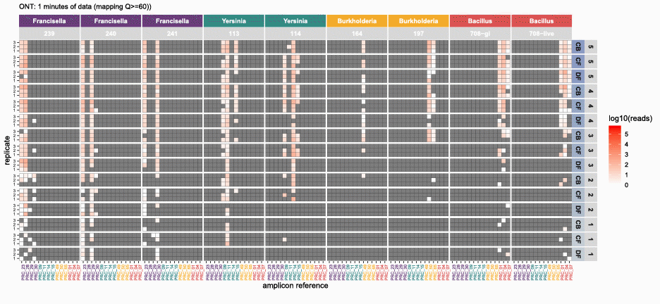
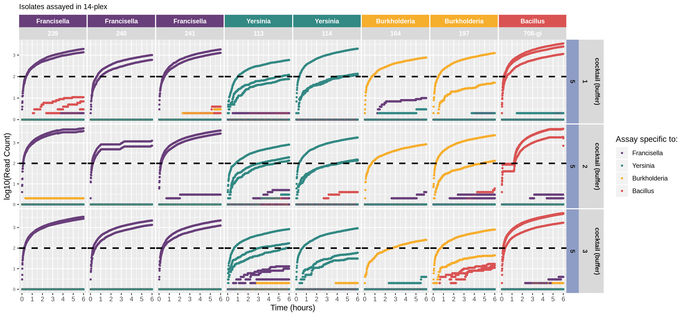

<meta name="google-site-verification" content="thZ03i6puJU5pePqHJFqpCRgv_FgA17ToxfvUw2BSZE" />

# nanotimeparse

This is the repository for nanotimeparse. It parses an Oxford Nanopore fastq file on read sequencing start times.

It can generate the read data that underpins visualizations like these from (also please cite this publication if using nanotimeparse):

[`Player, R., Verratti, K., Staab, A. et al. Comparison of the performance of an amplicon sequencing assay based on Oxford Nanopore technology to real-time PCR assays for detecting bacterial biodefense pathogens. BMC Genomics 21, 166 (2020). https://doi.org/10.1186/s12864-020-6557-5`](https://doi.org/10.1186/s12864-020-6557-5):

## Description

Get subsets of (-i) Oxford Nanopore Technologies (ONT) basecalled fastq reads in slices of (-s) minutes, over a period of (-p) minutes. Input fastq file is output as 2 sets of n fasta files (n = p/s). Set 1 is n fasta files, and each file contains reads generated from the start of the ONT run to each time slice. Set 2 is also n fasta files, but each file contains only newly generated reads between each time slice.

## Notes

	- WARNING: there may be identical fasta headers in output fasta files
	- for best results, p should be evenly divisible by s (i.e. p/s = INT)
	- using INT for minutes is preferrable, however, FLOAT is fine if p/s = INT
	- example output, see \`sandbox/nanotimeparse-test.fq/\`, and check log for details
	- be sure to concatenate all fastq files output from a single ONT flowcell

## Usage

`nanotimeparse.sh -t <threads> -i </absolute/path/to/nanopore_basecalled.fastq> -s <minutes> -p <minutes>`

	-h	help		help message
	-t	INT		number of threads to GNU parallel over
	-i	FASTQ		input ONT basecalled fastq
	-s	INT or FLOAT	time slice in (minutes)
	-p	INT or FLOAT	period of time to slice up since start of sequencing run (minutes)

#### Runtime:

Executing with *10 threads* (@2.1GHz), and slicing on every hour over a 48 hour period (*96 fasta files* as output), nanotimeparse takes about *30 minutes* to parse *1.2M reads (~15GB)* into both sets (and memory maxes out at (15GB/2)*10~=75GB, see below).

#### Memory Considerations:

When running nanotimeparse, each thread requires ~1/2 the size of your input fastq file in memory.

For Example:

`nanotimeparse.sh -t 10 -i sample.fastq -s 1 -p 5`

If input (-i) sample.fastq is 1.0GB, each thread requires ~0.5GB memory.

Since we're running with 10 threads, the entire run will require ~5GB memory to complete successfully.

## Dependencies

GNU Parallel [1] and GNU CoreUtils: cat, mkdir, sed, sort, cut, date, paste, basename, printf, comm, grep, awk, uniq, dirname, split, find, head, bc, seq, tail, wc

## Installation

The only non-GNU CoreUtils dependency is GNU Parallel [[2]](https://www.gnu.org/software/parallel/).

If you'd like to call the tool globally, symbolically link the shell script into a $PATH path. For example:

`sudo ln -s $PWD/nanotimepare/nanotimeparse.sh /usr/local/bin`

#### on Linux

	sudo apt install parallel
	git clone https://github.com/raplayer/nanotimeparse.git

#### on Mac OS X

	sudo apt install parallel
	brew install coreutils
	brew install gnu-sed
	git clone https://github.com/raplayer/nanotimeparse.git

## License and Copyright

Copyright (c) 2019 The Johns Hopkins University Applied Physics Laboratory

This program is free software: you can redistribute it and/or modify it under the terms of the GNU Affero General Public License as published by the Free Software Foundation, either version 3 of the License, or (at your option) any later version.

This program is distributed in the hope that it will be useful, but WITHOUT ANY WARRANTY; without even the implied warranty of MERCHANTABILITY or FITNESS FOR A PARTICULAR PURPOSE. See the GNU Affero General Public License for more details.

You should have received a copy of the GNU Affero General Public License along with this program. If not, see https://www.gnu.org/licenses/.

## References

1. Player, R., Verratti, K., Staab, A. et al. Comparison of the performance of an amplicon sequencing assay based on Oxford Nanopore technology to real-time PCR assays for detecting bacterial biodefense pathogens. BMC Genomics 21, 166 (2020). https://doi.org/10.1186/s12864-020-6557-5
2. O. Tange (2011): GNU Parallel - The Command-Line Power Tool, ;login: The USENIX Magazine, February 2011:42-47.

